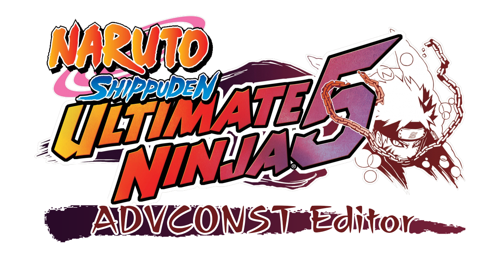

# About
UN5 ADVCONST Editor is a tool designed to edit the "ADVCONST.CCS" file in the ADV folder of the game Naruto Shippuden: Ultimate Ninja 5. This file contains all the .ccs files of the maps listed in Master Mode along with some of their settings.
